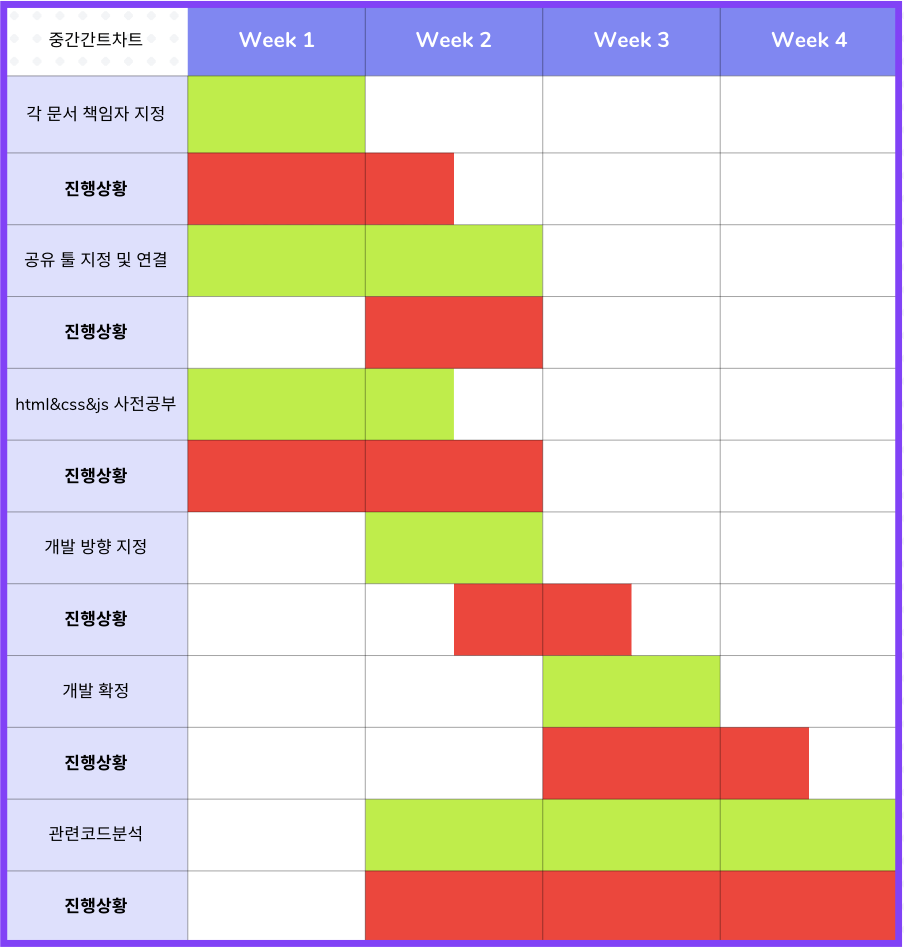
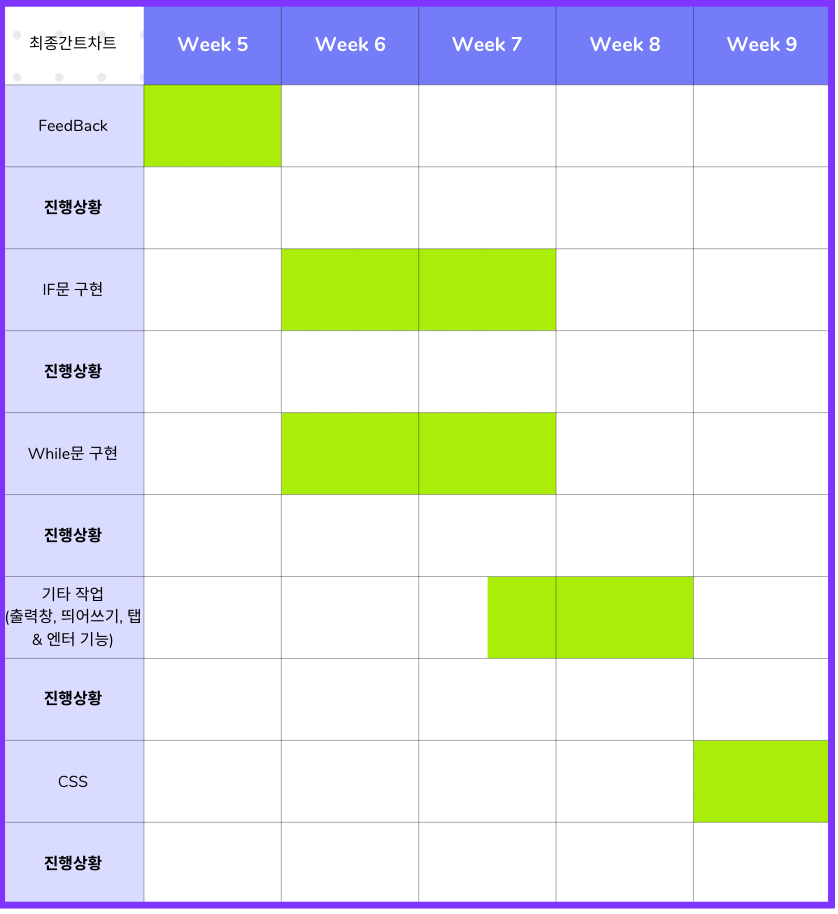

# flow-to-code

# flow-to-code Web page
> **한경대학교 컴퓨터공학과 소프트웨어융합 학부생**

> **개발기간:2023.09 - 2023.12**

## 웹개발팀 소개
|      이주훈       |       김호탁      |       이상민     |      정재형      |       조정행       |
| :-------------: | :-------------: | :-------------: | :-------------: | :-------------: |
|   [@whdjh](https://github.com/whdjh)   |    [@?](깃허브주소)  | [@?](깃허브주소) | [@jaehyeongjung](https://github.com/jaehyeongjung) | [@?](깃허브주소) |
| 한경대 컴퓨터공학과 sc 4학년 | 한경대 컴퓨터공학과 sc 4학년 | 한경대 컴퓨터공학과 sc 4학년 | 한경대 컴퓨터공학과 sc 4학년 | 한경대 컴퓨터공학과 sc 4학년 |

## 프로젝트 소개
3학년 융합프로젝트프로젝트에서 프로젝트를 진행한 flow_to_chart라는 프로젝트입니다. 

22년 8월 22일 교육부에서 발표한 [디지털 시대의 주인공이 될 100만 인재를 양성합니다.] 내용 中 

초등, 중등교육에서 코딩 교육을 필수, 고등에서는 선택과목으로 운영함에 따라, 

적합한 수준의 교육 도구들이 요구되고 있습니다. 

이 중 절차적 프로그래밍 기초를 가장 직관적으로 이해할 수 있는 도구인 

순서도(플로우차트)를 조합하면 코드를 생성해주는 소프트 웨어를 제작하여, 

코드를 처음 접할 때 기초 프로그래밍을 쉽게 이해할 수 있도록 교육 자료를 만들고자합니다.

## 기술스택

## 개발 환경

             

## 다이어그램

## 간트차트

## 화면 구성 및 실행 화면 📺
| 시작 페이지 | 메인 페이지 |
| :-------------------------------------------: | :------------: |
|  |  |  
| 실행화면1 | 실행화면2 |  
|  |  |

## 주요 기능

### 플로우차트를 그리면 자동으로 코드를 구성

## 코드 구조
* image
  -logo.png
  
* js
  - codeBlock.js
  - endBlock.js
  - endifBlock.js
  - handler.js
  - ifBlock.js
  - inputBlock.js
  - lin.js
  - main.js
  - outputBlock.js
  - point.js
  - small.js
  - startBlock.js
  - ui.js
  - whileBlock.js

* json
  
* info.php
  
* index.html

* guid.html
